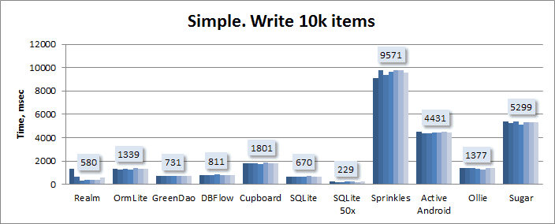
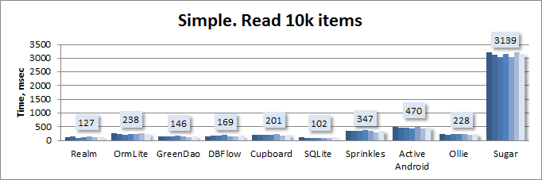
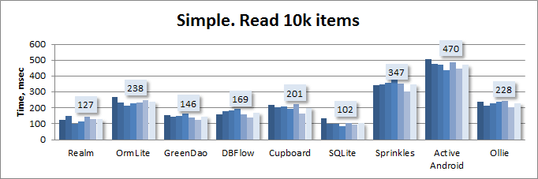
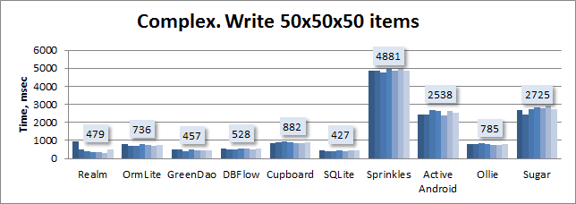
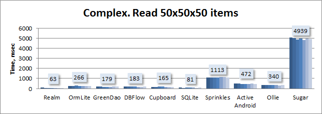
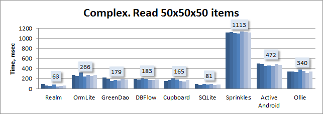

# AndroidDatabaseLibraryComparison
A test between a few of the popular libraries running a speed test on how fast they load and save data.

## Benchmark Description

There are two benchmarks:  
Simple model. Writes and reads 10000 times:
```java
public class SimpleAddressItem{
  String name;
  String address;
  String city;
  String state;
  long phone;
}
```
Complex model. Writes and reads 50x times with 50 items in each collection:
```java
public class AddressBook{
    Long id;
    String name;
    String author;
    Collection<AddressItem> addresses;
    Collection<Contact> contacts;
}
public class AddressItem extends SimpleAddressItem {
    private AddressBook addressBook;
}
public class Contact{
    String name;
    String email;
    AddressBook addressBook;
}
```


## Results

These are the results for the Simple trial:
Write:  
  
Read:  
  
Read without Sugar:  


And these are the results for the Complex trial:
Write:  
  
Read:  
  
Read without Sugar:  

